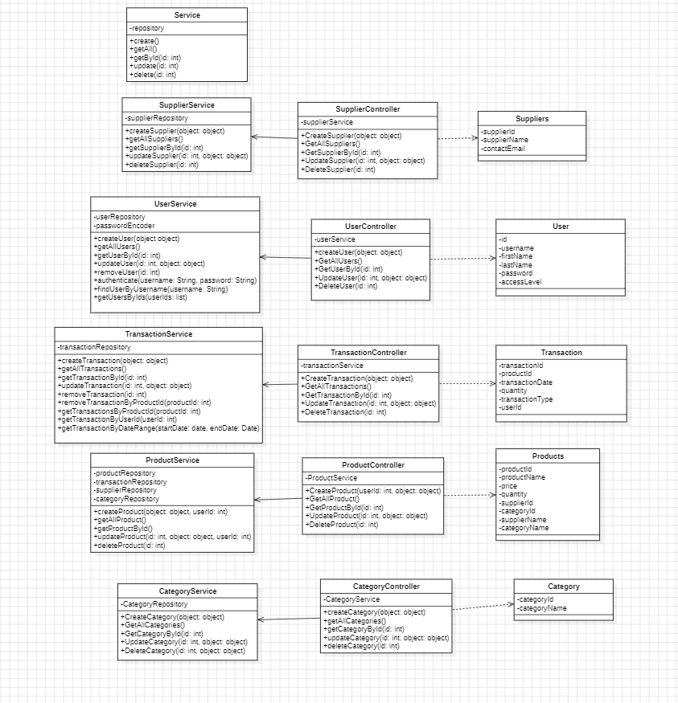
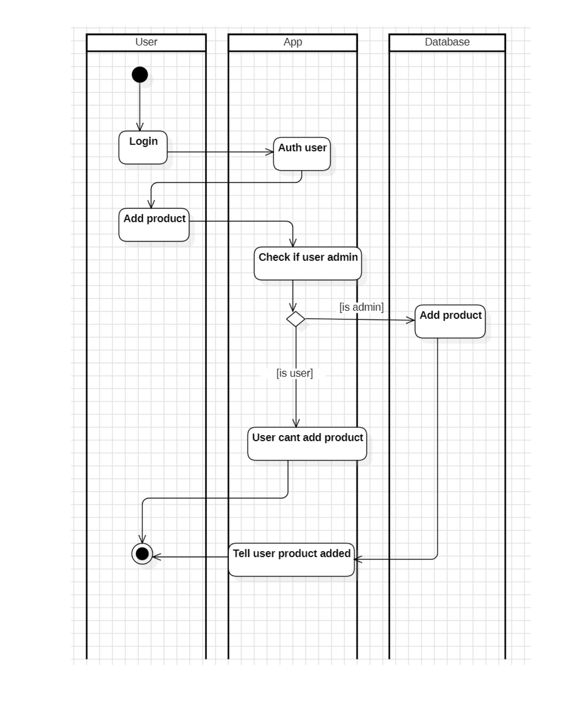
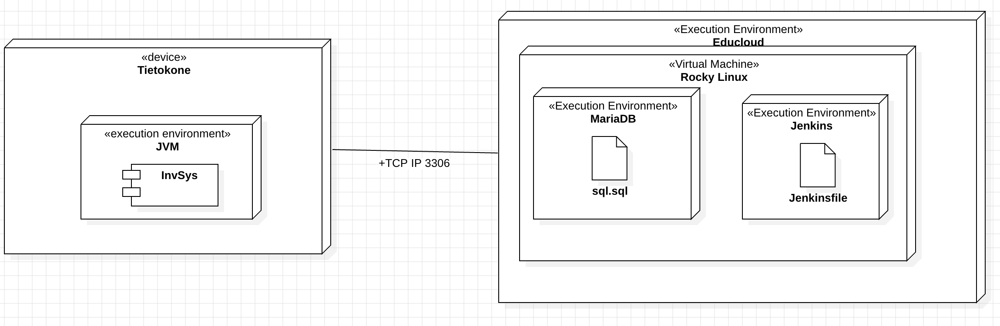
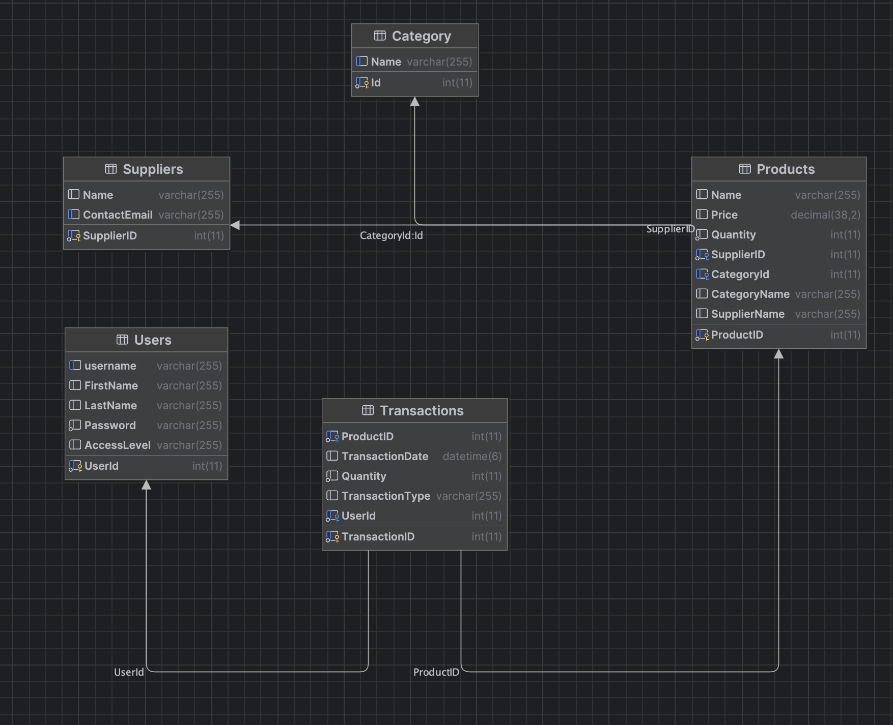

# Project Documentation

## Table of Contents

- [1. Project Overview](#1-Project-Overview)

- [2. Customer Requirements](#2-customer-requirements)

- [3. Development Methods](#3-development-methods)

- [4. System Design and Architecture](#4-system-design-and-architecture)

  - [4.1 Technologies Used](#41-Technologies-Used)

  - [4.2 Software Design](#42-Software-Design)

  - [4.3 System Architecture](#43-System-Architecture)

- [5. Implementation](#5-implementation)

  - [5.1 UI](#51-ui)

  - [5.2 Database](#52-database)

- [6. QA](#6-qa)

  - [6.1 Testing](#61-testing)

  - [6.2 Clean Code](#62-clean-code)

- [7. Deployment Process](#7-Deployment-Process)

- [8. Summary](#8-summary)


# 1. Project Overview

### Project Name
**VectraVault**

### Description
VectraVault is a JavaFX-based inventory management system tailored for small businesses and individual users to effectively manage their item catalogs. The system simplifies tracking, updating, and managing inventory, ensuring seamless operations while reducing manual errors.

### Goals
- Deliver a robust and user-friendly platform for inventory management.
- Enable easy tracking of inventory levels and transactions.
- Provide tools for generating insightful reports for better decision-making.

### Scope
VectraVault incorporates the following features:
- **User Authentication**: Registration and login functionality.
- **Product Management**: Add, update, delete, and view products.
- **Inventory Tracking**: Monitor inventory levels to prevent overstocking or stock outs.
- **Transaction Management**: Log and analyze inventory movements.
- **Report Generation**: Generate reports for better insights into inventory operations, things like stock of all products, transactions by product ID, transactions by user ID, and transactions by date.

### Target Audience
VectraVault is designed for businesses, inventory managers, and individuals seeking an efficient tool to manage their inventory.

### Technology Stack
- **Frontend**: JavaFX for a user-friendly graphical interface.
- **Backend**: SpringBoot for robust backend functionality.
- **Database**: MariaDB for storing inventory, transaction data and user information.


# 2. Customer Requirements

For inventory management system, the customer requires the following features:

### 2.1 Product Management
- **Add Product**  
  Capability to add new products to the inventory, including fields for:
  - Product name
  - Product price
  - Quantity
  - Category
  - Supplier


- **Delete Product**  
  Option to permanently remove products from the inventory when no longer needed.


- **Edit/Update Product**  
  Allow updates to:
  - Product name
  - Product price
  - Quantity
  - Category
  - Supplier
---

### 2.2 Product Search and Sorting
- **Search Products**  
  A search bar to quickly locate products by:
  - Product name


- **Sort Products in Tables**  
  Sort tables by:
  - Name
  - Price
  - Quantity
  - Supplier
  - Category
---

### 2.3 Reports
- **Generate Reports**

  Create inventory reports:
  - All stock products
  - Transactions by product ID
  - Transactions by user ID
  - Transactions by date
---

### 2.4 Transactions Page
- **View Transactions**  
  Display all transactions in a table with the following columns:
  - Transaction ID
  - Product ID
  - Transaction date
  - Quantity
  - Transaction type (Add, Update, Delete)
  - User that made the transaction
---

### 2.5 Reports
- **Generate Reports**  
  Create inventory reports:
  - All stock products
  - Transactions by product ID
  - Transactions by user ID
  - Transactions by date
---

### 2.6 User Management
- **User Authentication**  
  Login and register for users with:
  - Name
  - Username
  - Password
---
# 3. Development Methods
## 1. Methodology Used
We adopted the Agile methodology to ensure iterative development and regular feedback. We held daily (or every other day) Scrum meetings over Discord to review what we had accomplished in the previous day(s) and discuss our goals. During these meetings, we assessed whether we were on track to meet our objectives and ensured that we were heading in the right direction.

## 2. Phases of Development

### Planning
We gathered information about the functionalities and qualities needed for our application to achieve the goals and vision we had set.

### Design
We brainstormed how the application should look and function during each phase. For now, the first version of our application can be considered complete. In this phase, we also discussed the application’s architecture, database design, and its localization implementation.

### Implementation
We began implementing the features and plans outlined during the planning and design phases.

### Testing
After the implementation phase (note that unit tests were written during implementation to test the core functionalities throughout), we conducted thorough testing of our application. This included both manual testing and tool-assisted testing. We performed various types of tests, such as regression, acceptance, load, stress, and end-to-end testing. During this phase, we welcomed a new team member, who contributed to accelerating the testing process.

## 3. Team Collaboration
We used a variety of tools to stay organized and on track as a team. Discord was our primary platform for daily meetings, where we discussed progress and planned the next steps. Additionally, we tracked our tasks using Trello, which made it easier to remember completed tasks, monitor ongoing ones, and plan future work.

## 4. Why This Method?
The Agile methodology allowed us to stay on track and up-to-date while enabling us to respond to changes quickly. This approach ensured we could adjust our processes whenever necessary.


# 4. System Design and Architecture

## 4.1 Technologies Used

### Introduction
This document provides an overview of the technologies used in the development of the project.

**Frontend:** JavaFX
**Backend:** Spring Boot
**Database:** MariaDB
**Authentication:** Spring Security
**Version Control:** Git, GitHub
**Build Tool:** Maven
**CI/CD:** Jenkins
**Testing:** JUnit, Jacoco, Mockito


## 4.2 Software Design

### Introduction

This document will provide a detailed description of the system's design, including major classes, functions, and algorithms.

### Class Diagram



### Authentication Flow

**1. User Login**: The user logs in with their username and password.

- The system checks the credentials against the stored user data.

**2. User Register**

- The user enters first name, last name, username, password.

**3. Token Generation**: On successful login, a token is generated.

- This token is used for secure access to user-specific data.

**4. Token Validation**: For each subsequent request, the token is validated to ensure the user is authenticated.

- If the token is valid, the request is processed; otherwise, an authentication error is returned.

#### Key Classes:
- [LoginController](/src/main/java/com/reppuhallinta/inventory_management_sys/controller/LoginController.java): Handles user login requests.
- [RegisterController](/src/main/java/com/reppuhallinta/inventory_management_sys/controller/RegisterController.java): Handles user registration requests.

### Product Management Flow

#### 1. Product Creation:

- The user fills in the product details (name, price, quantity, category, supplier) in the form.
- The system validates the input fields.
- The system retrieves the selected category and supplier IDs.
- The system parses and validates the product price and quantity.
- The system creates a new product using the provided details and logs the transaction.
  

##### Key Classes:

- [CreateProductController](/src/main/java/com/reppuhallinta/inventory_management_sys/controller/CreateProductController.java): Handles the product creation form.
- [ProductService](/src/main/java/com/reppuhallinta/inventory_management_sys/service/ProductService.java): Manages product-related operations.
- [TransactionService](/src/main/java/com/reppuhallinta/inventory_management_sys/service/TransactionService.java): Manages transaction-related operations.

#### 2. Product Update:

- The user fills in the product details (name, price, quantity, category, supplier) in the form.
- The system validates the input fields.
- The system retrieves the selected category and supplier IDs.
- The system parses and validates the product price and quantity.
- The system creates a new product using the provided details and logs the transaction.

##### Key Classes:

- [EditProductController](/src/main/java/com/reppuhallinta/inventory_management_sys/controller/EditProductController.java): Handles the product update form.
- [ProductService](/src/main/java/com/reppuhallinta/inventory_management_sys/service/ProductService.java): Manages product-related operations.
- [TransactionService](/src/main/java/com/reppuhallinta/inventory_management_sys/service/TransactionService.java): Manages transaction-related operations.

#### 3. Product Deletion:

- The user selects a product from the list.
- The system retrieves the selected product ID.
- The system deletes the product from the database and logs the transaction.
- The system updates the product list.

##### Key Classes:

- [ProductViewController](/src/main/java/com/reppuhallinta/inventory_management_sys/controller/ProductViewController.java): Contains the method for product deletion.
- [ProductService](/src/main/java/com/reppuhallinta/inventory_management_sys/service/ProductService.java): Manages product-related operations.
- [TransactionService](/src/main/java/com/reppuhallinta/inventory_management_sys/service/TransactionService.java): Manages transaction-related operations.


### Transaction Management Flow

#### 1. Transaction Logging:
- The system logs all product-related transactions (creation, update, deletion).
- The system records the user who made the transaction, the product involved, and the type of transaction.
- The system timestamps each transaction for tracking purposes.
- The system stores the transaction data in the database for future reference.
- The system provides a transaction history view for users to track changes.
- The system allows users to filter transactions by date, user, or product.

##### Key Classes:
- [TransactionService](/src/main/java/com/reppuhallinta/inventory_management_sys/service/TransactionService.java): Manages transaction-related operations.
- [TransactionController](/src/main/java/com/reppuhallinta/inventory_management_sys/controller/TransactionController.java): Handles transaction history requests.

### Report Generation Flow

#### 1. Report Export:
- The user selects if they want to export all products in stock, transactions by product id, transaction by user id or transaction by date
- The system creates a text file with the selected data
- The system saves the file to the user's computer to selected location

##### Key Classes:
- [ReportController](/src/main/java/com/reppuhallinta/inventory_management_sys/controller/ReportViewController.java): Handles report generation requests.

### Search Functionality

#### 1. Product Search:
- The user enters a search query in the search bar.
- The system retrieves products that match the search query.
- The system displays the search results to the user in the table view.

#### 3. Transaction Search:
- The user enters a search query in the search bar.
- The system retrieves transactions that match the search query.
- The system displays the search results to the user in the table view.

##### Key Classes:
- [ProductViewController](/src/main/java/com/reppuhallinta/inventory_management_sys/controller/ProductViewController.java): Contains the method for product search.
- [TransactionViewController](/src/main/java/com/reppuhallinta/inventory_management_sys/controller/TransactionViewController.java): Contains the method for transaction search.

## 4.3 System Architecture

### Overview
- Overall architecture of the system

### System Architecture
- Frontend: JavaFX
- Backend: Spring Boot
- Database: MariaDB

### Diagrams

#### Deployment diagram


#### Database diagram



# 5. Implementation


## 5.1 UI


## 5.2 Database

[Database Script](..%2Fsqlscript)

## Tables and Purpose

### 1. `Category`
- **Purpose**: Organizes products by category.
- **Columns**:
  - `Id`: Primary key.
  - `Name`: Unique category name.

---

### 2. `Suppliers`
- **Purpose**: Stores supplier details.
- **Columns**:
  - `SupplierID`: Primary key.
  - `Name`: Supplier name.
  - `ContactEmail`: Unique email.

---

### 3. `Products`
- **Purpose**: Maintains product details and links to suppliers and categories.
- **Columns**:
  - `ProductID`: Primary key.
  - `Name`: Product name.
  - `Price`: Decimal price.
  - `Quantity`: Stock count (not null).
  - `SupplierID`: Foreign key to `Suppliers`.
  - `CategoryId`: Foreign key to `Category`.
  - **Indexes**: `SupplierID`.

---

### 4. `Users`
- **Purpose**: Manages user authentication and roles.
- **Columns**:
  - `UserId`: Primary key.
  - `username`: Unique username.
  - `Password`: Encrypted (not null).
  - `AccessLevel`: User role.

---

### 5. `Transactions`
- **Purpose**: Logs product sales or restocking.
- **Columns**:
  - `TransactionID`: Primary key.
  - `ProductID`: Foreign key to `Products`.
  - `TransactionDate`: Timestamp.
  - `Quantity`: Transaction quantity.
  - `TransactionType`: Sale or restock.
  - `UserId`: Foreign key to `Users`.
  - **Indexes**: `ProductID`, `UserId`.

---

## Key Relationships
1. **Products ↔ Category**: Linked via `CategoryId`.
2. **Products ↔ Suppliers**: Linked via `SupplierID`.
3. **Transactions ↔ Products**: Linked via `ProductID`.
4. **Transactions ↔ Users**: Linked via `UserId`.

---

# 6. QA

### User Acceptance Testing (UAT)

- **Description**: Manual testing by project team members to validate the application against business requirements. Feedback is also gathered from real users to ensure the application meets their needs.
- **Tools**: Manual testing by project team members
- **Tools**: Discord for live testing sessions and reporting bugs. Team members communicated and documented any issues or feedback directly in Discord.


## 6.1 Testing
### Unit Testing
- **Framework**: JUnit
- **Description**: JUnit is used for testing individual methods and classes in isolation to ensure they work as expected.
- **Tools**: JUnit, Mockito
- **Tests done**: 
  - **testUser**
  - **testProductAndSupplier**
  - **testCategory**
  - **testTransaction**

### Integration Testing

- **Framework**: Spring Boot Test
- **Description**: Spring Boot Test is used for testing the integration of multiple components, such as controllers, services, and repositories, to ensure they work together correctly.
- **Tools**: Spring Boot Test, Mockito

### User Acceptance Testing (UAT)

- **Description**: Manual testing by project team members to validate the application against business requirements. Feedback is also gathered from real users to ensure the application meets their needs.
- **Tools**: Manual testing by project team members
- **Tools**: Discord for live testing sessions and reporting bugs. Team members communicated and documented any issues or feedback directly in Discord.

### Performance Testing

- **Description**: Apache JMeter is used to simulate multiple users accessing the system simultaneously to test its behavior under stress.
- **Tools**: Apache JMeter

### Functional Testing
- **Description**: Functional testing ensures that the system behaves according to the specified requirements.
- **Tools**: Manual testing by project team members
- **Tests done**: 
  - **Registeration**
  - **Login**
  - **Changing language**
  - **Product creation**
  - **Changing product name**
  - **Changing product amount**
  - **Removing product**
  - **Editing action**
  - **Exporting report**
  - **Exporting with user ID report**


## 6.2 Clean Code
### 1. Principles Applied  
We adhered to common programming conventions throughout the development process. This included writing meaningful names for variables, functions, and classes (e.g., `updateStock()` instead of `us()`). We also ensured that functions were designed to perform a single responsibility wherever possible (e.g., a function for "add inventory" only adds inventory and does not perform unrelated calculations).  

### 2. Consistency  
We followed the Google Java Style Guide wherever feasible. To ensure consistency, we used tools such as **Checkstyle**, **PMD**, **SpotBugs**, and **SonarLint** to check our code for adherence to coding standards.  

### 3. Commenting and Documentation  
We wrote proper comments where necessary and created detailed Javadoc for public methods and classes. Additionally, we prepared different types of documentation to clarify various aspects of the application. This included:  
   - **Software Design Documentation**  
   - **System Architecture Documentation**  
   - **Testing Strategy Documentation**  
   - **User Documentation**  

### 4. Error Handling  
We implemented error-handling mechanisms using `try-catch` blocks to print stack traces when errors occurred. Logging was also used to monitor application behavior and track errors. For front-end errors, we utilized `try-catch` blocks to handle issues and provided users with clear pop-up messages to notify them of incorrect actions or invalid inputs.  

### 5. Code Review and Refactoring  
We added a **CODEOWNERS** file to our GitHub repository and implemented a structured code review process. This included:  
   - Configuring restrictions to prevent direct pushes to the main branch.  
   - Requiring contributors to create new branches for changes and submit pull requests (PRs).  
   - Mandating that at least one code owner review and approve the PR before it could be rebased and merged into the main branch.  
Code reviews were performed for every PR to maintain clear, efficient, and high-quality code.  

### 6. Impact on Maintainability  
By following code conventions, using best practices, leveraging tools, and implementing thorough error handling and reviews, we ensured that the codebase remains easy to maintain and scalable for future development.  


# 7. Deployment Process
**1. Clone the repository**
```sh
git clone https://github.com/Jafestro/Inventory-Management-Sys.git
```

**2. Setup database**

You can use for example MariaDB/MySQL.

You can get sql script from here:

[SQL SCRIPT](../sqlscript)

**3. Setup database connection in code**
Navigate to following file in code:
```sh
src/main/resources/application.properties
```

Copy the following and replace the placeholders with your database credentials:

Replace the file in src/main/resources/application.properties with the following:
```sh 
 spring.application.name=inventory_management_sys

spring.datasource.url=jdbc:mariadb://localhost:3306
spring.datasource.username={YOUR DATABASE USERNAME}
spring.datasource.password={YOUR DATABASE PASSWORD}
spring.datasource.driver-class-name=org.mariadb.jdbc.Driver
spring.jpa.hibernate.ddl-auto=update

# Custom properties for schemas
app.datasource.schema.default=jdbc:mariadb://localhost:3306/invsys

# Show SQL queries in the console
spring.jpa.show-sql=true

# Use PhysicalNamingStrategyStandardImpl to respect table and column names
spring.jpa.hibernate.naming.physical-strategy=org.hibernate.boot.model.naming.PhysicalNamingStrategyStandardImpl
```

**4. Run the application**
```sh
mvn clean install
```

**5. Start the application**
```sh
mvn clean javafx:run
```

**IF YOU ARE USING INTELLIJ YOU MIGHT HAVE TO ADD JAVAFX SDK FILE**

[How to add JavaFX SDK to IntelliJ IDEA](https://www.jetbrains.com/help/idea/sdk.html)

## 8. Summary

The **VectraVault Inventory Management System** serves as an innovative and user-friendly solution tailored to address the challenges of inventory management for small businesses and individuals. Developed using modern technologies and adhering to robust software engineering practices, VectraVault combines functionality, efficiency, and scalability.

### Key Highlights:
1. **Core Features**:
   - **User Authentication**: Secure registration and login for multiple users.
   - **Product Management**: Easy addition, updating, and removal of products with detailed attributes.
   - **Inventory Tracking**: Real-time monitoring to prevent stock discrepancies.
   - **Transaction Management**: Comprehensive logs of inventory actions categorized by user, date, and product.
   - **Reports**: Exportable insights to aid decision-making, with filters based on product, user, and date.

2. **Technology Stack**:
   - **Frontend**: JavaFX for an interactive and intuitive UI.
   - **Backend**: Spring Boot ensuring robust backend operations.
   - **Database**: MariaDB for scalable and efficient data storage.

3. **Development Approach**:
   - Agile methodology ensured iterative development and adaptability.
   - Tools like Discord and Trello facilitated seamless team collaboration.
   - A well-structured testing phase guaranteed software quality.

4. **System Design and Architecture**:
   - Comprehensive software and database design, ensuring maintainability and scalability.
   - Implementation of authentication flows and secure token management.
   - Modular and clean architecture separating concerns for easier future enhancements.

5. **Clean Code Practices**:
   - Adherence to the Google Java Style Guide.
   - Automated code reviews and quality checks via tools like Checkstyle and SonarLint.
   - Detailed commenting, documentation, and consistent error handling.

6. **Deployment**:
   - A straightforward deployment process involving database setup, configuration, and application execution.
   - Comprehensive documentation to assist users and developers in setup and usage.

### Project Outcomes:
VectraVault delivers on its promise of creating a seamless inventory management system by leveraging state-of-the-art technologies and methodologies. Its structured approach ensures easy maintainability, security, and adaptability for future enhancements, making it an invaluable tool for businesses of any scale. With a commitment to high-quality code, thoughtful design, and robust testing, the project is well-equipped to handle real-world inventory management challenges.


