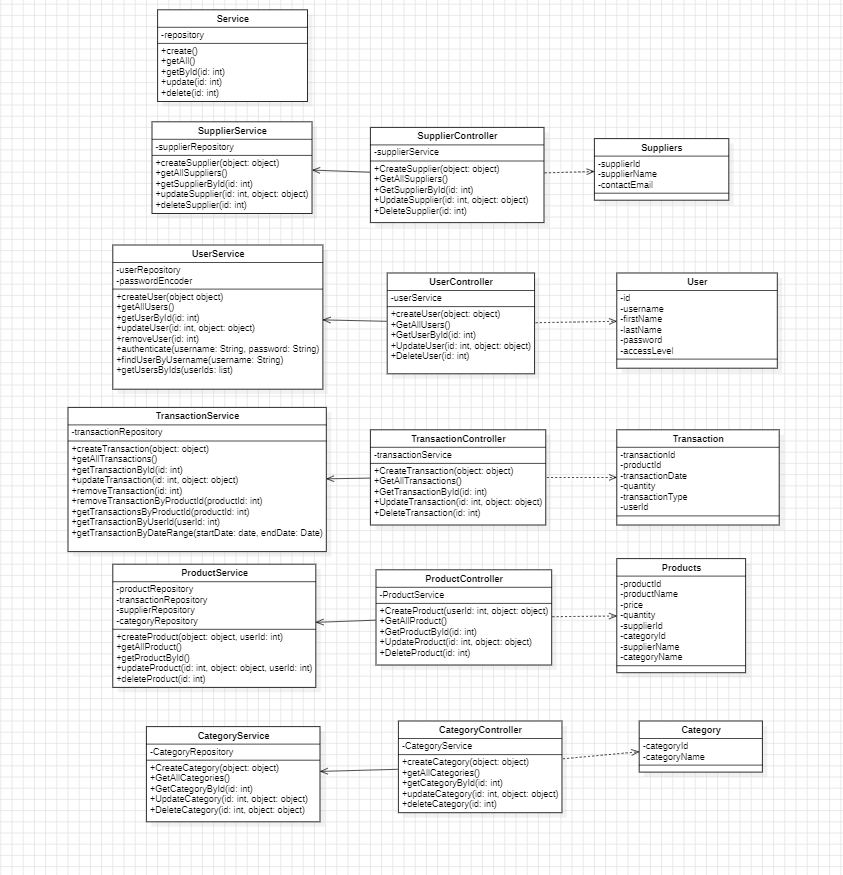

# Software Design

## Introduction

This document will provide a detailed description of the system's design, including major classes, functions, and algorithms.

## Class Diagram

## Authentication Flow

**1. User Login**: The user logs in with their username and password.

- The system checks the credentials against the stored user data.

**2. Token Generation**: On successful login, a token is generated.

- This token is used for secure access to user-specific data.

**3. Token Validation**: For each subsequent request, the token is validated to ensure the user is authenticated.

- If the token is valid, the request is processed; otherwise, an authentication error is returned.

#### Key Classes:
- [LoginController](/src/main/java/com/reppuhallinta/inventory_management_sys/controller/LoginController.java): Handles user login requests.
- [RegisterController](/src/main/java/com/reppuhallinta/inventory_management_sys/controller/RegisterController.java): Handles user registration requests.

## Product Management Flow

#### 1. Product Creation:

- The user fills in the product details (name, price, quantity, category, supplier) in the form.
- The system validates the input fields.
- The system retrieves the selected category and supplier IDs.
- The system parses and validates the product price and quantity.
- The system creates a new product using the provided details and logs the transaction.
  

##### Key Classes:

- [CreateProductController](/src/main/java/com/reppuhallinta/inventory_management_sys/controller/CreateProductController.java): Handles the product creation form.
- [ProductService](/src/main/java/com/reppuhallinta/inventory_management_sys/service/ProductService.java): Manages product-related operations.
- [TransactionService](/src/main/java/com/reppuhallinta/inventory_management_sys/service/TransactionService.java): Manages transaction-related operations.

#### 2. Product Update:

- The user fills in the product details (name, price, quantity, category, supplier) in the form.
- The system validates the input fields.
- The system retrieves the selected category and supplier IDs.
- The system parses and validates the product price and quantity.
- The system creates a new product using the provided details and logs the transaction.

##### Key Classes:

- [EditProductController](/src/main/java/com/reppuhallinta/inventory_management_sys/controller/EditProductController.java): Handles the product update form.
- [ProductService](/src/main/java/com/reppuhallinta/inventory_management_sys/service/ProductService.java): Manages product-related operations.
- [TransactionService](/src/main/java/com/reppuhallinta/inventory_management_sys/service/TransactionService.java): Manages transaction-related operations.

#### 3. Product Deletion:

- The user selects a product from the list.
- The system retrieves the selected product ID.
- The system deletes the product from the database and logs the transaction.
- The system updates the product list.

##### Key Classes:

- [ProductViewController](/src/main/java/com/reppuhallinta/inventory_management_sys/controller/ProductViewController.java): Contains the method for product deletion.
- [ProductService](/src/main/java/com/reppuhallinta/inventory_management_sys/service/ProductService.java): Manages product-related operations.
- [TransactionService](/src/main/java/com/reppuhallinta/inventory_management_sys/service/TransactionService.java): Manages transaction-related operations.

## Transaction Management Flow

#### 1. Transaction Logging:
- The system logs all product-related transactions (creation, update, deletion).
- The system records the user who made the transaction, the product involved, and the type of transaction.
- The system timestamps each transaction for tracking purposes.
- The system stores the transaction data in the database for future reference.
- The system provides a transaction history view for users to track changes.
- The system allows users to filter transactions by date, user, or product.

##### Key Classes:
- [TransactionService](/src/main/java/com/reppuhallinta/inventory_management_sys/service/TransactionService.java): Manages transaction-related operations.
- [TransactionController](/src/main/java/com/reppuhallinta/inventory_management_sys/controller/TransactionController.java): Handles transaction history requests.

## Report Generation Flow

#### 1. Report Export:
- The user selects if they want to export all products in stock, transactions by product id, transaction by user id or transaction by date
- The system creates a text file with the selected data
- The system saves the file to the user's computer to selected location

##### Key Classes:
- [ReportController](/src/main/java/com/reppuhallinta/inventory_management_sys/controller/ReportViewController.java): Handles report generation requests.