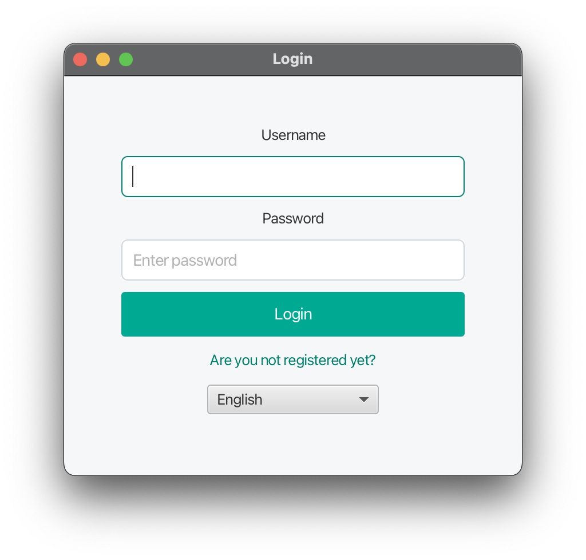
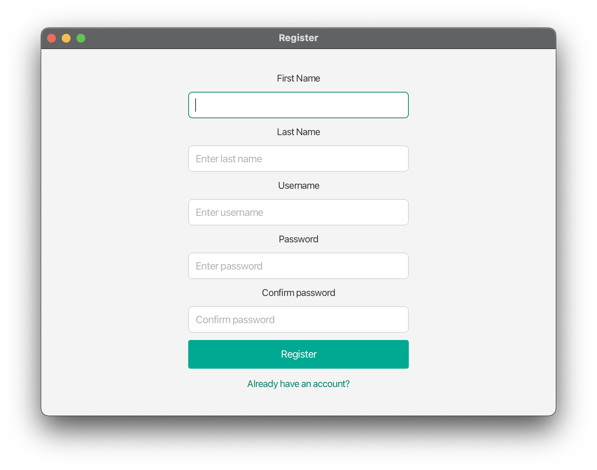
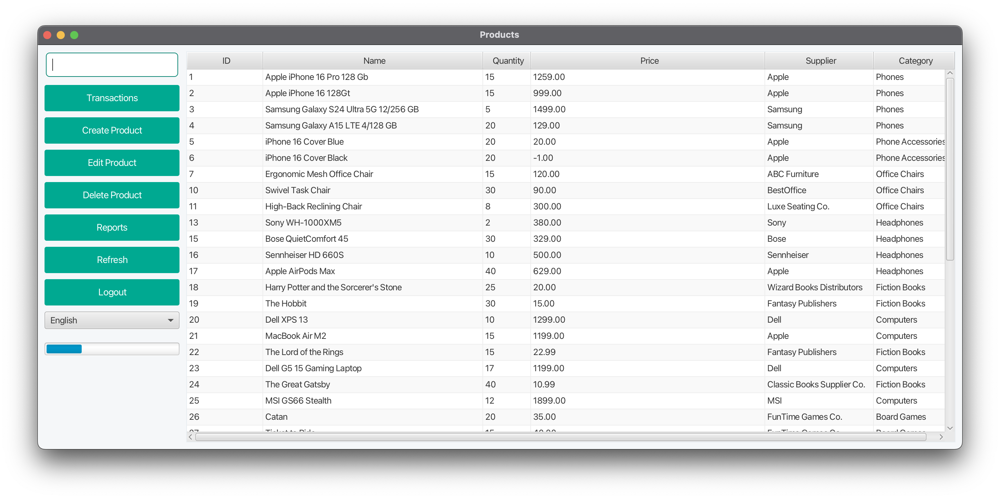
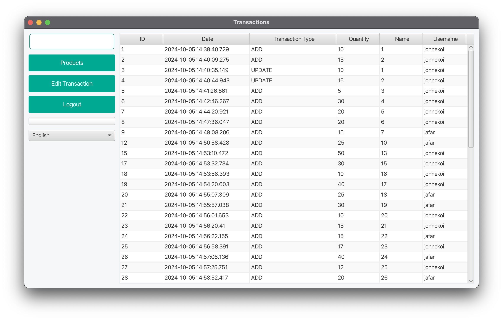
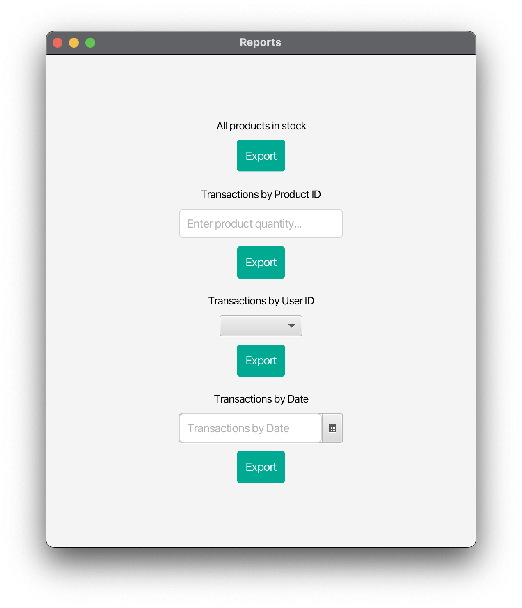

# User Documentation

- [Purpose](#purpose)
- [Audience](#Audience)
- [Examples](#Examples)
  - [User Manual](#User-Manual)
  - [Installation](#Installation)
  - [Tutorials](#Tutorials)
- [Key Features](#Key-Features)
    - [Features](#Features)
    - [Step by Step](#Instructions)

## Purpose


## Audience


## Examples


### User-Manual


### Installation
**1. Clone the repository**
```sh
git clone https://github.com/Jafestro/Inventory-Management-Sys.git
```

**2. Setup database**

You can use for example MariaDB/MySQL.

You can get sql script from here:

[SQL SCRIPT](../sqlscript)

**3. Setup database connection in code**
Navigate to following file in code:
```sh
src/main/resources/application.properties
```

Copy the following and replace the placeholders with your database credentials:

Replace the file in src/main/resources/application.properties with the following:
```sh 
 spring.application.name=inventory_management_sys

spring.datasource.url=jdbc:mariadb://localhost:3306
spring.datasource.username={YOUR DATABASE USERNAME}
spring.datasource.password={YOUR DATABASE PASSWORD}
spring.datasource.driver-class-name=org.mariadb.jdbc.Driver
spring.jpa.hibernate.ddl-auto=update

# Custom properties for schemas
app.datasource.schema.default=jdbc:mariadb://localhost:3306/invsys

# Show SQL queries in the console
spring.jpa.show-sql=true

# Use PhysicalNamingStrategyStandardImpl to respect table and column names
spring.jpa.hibernate.naming.physical-strategy=org.hibernate.boot.model.naming.PhysicalNamingStrategyStandardImpl
```

**4. Run the application**
```sh
mvn clean install
```

**5. Start the application**
```sh
mvn clean javafx:run
```

**IF YOU ARE USING INTELLIJ YOU MIGHT HAVE TO ADD JAVAFX SDK FILE**

[How to add JavaFX SDK to IntelliJ IDEA](https://www.jetbrains.com/help/idea/sdk.html)

# Tutorials
## Login Screen



Here you can login to the application.  
If you don't have an account, you can create one by clicking the "Are you not registered yet" button.

---

## Register Screen



Here you can register a new account.  
Fill in the required fields and click the "Register" button.

---

## Products Screen



Here you can view all products.  
On the left, you can manage different things by using the buttons.

---

## Transactions Screen



Here you can view all transactions.  
On the left, you can manage different things by using the buttons.

---

## Reports Screen



Here you can export different reports.  
You can get to this page by clicking the "Reports" button on the left in the products view.

---

## Edit Product Screen


Here you can edit a product.  
You can get to this window from the products view by selecting a product and then clicking the "Edit product" button.

---

## Edit Transaction Screen


Here you can edit a transaction.  
You can get to this window from the transactions view by selecting a transaction and then clicking the "Edit transaction" button.

---

## Create Product Screen


Here you can create a product.
You can get to this window from the products view by clicking the "Create product" button.


## Key-Features


### Features
1. Product Management:
  - Create, update, and delete products.
  - View a list of all products with detailed information including price, quantity, category, and supplier.
2. Category and Supplier Management:
  - Add new categories and suppliers.
  - View and select categories and suppliers when creating or updating products.
3. Transaction Tracking:
  - Automatic logging of transactions (add, update) for products.
  - View transaction history for auditing purposes.

### Instructions
