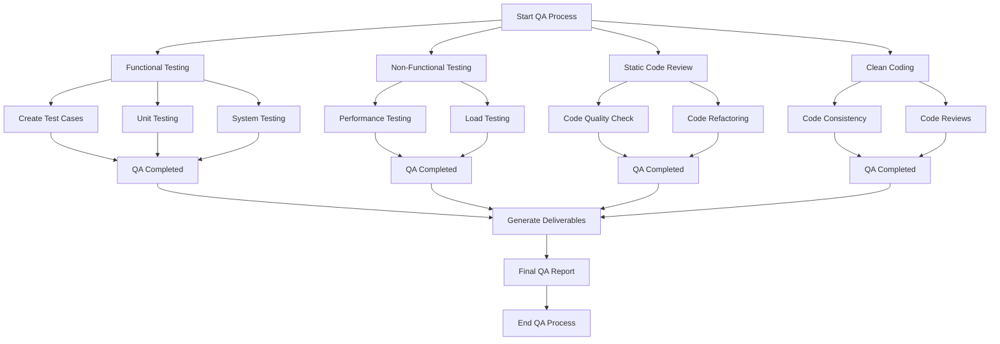

# Quality Assurance Plan

**Project Name:**  
*Inventory Management System*

**Date:**  
*10/11/2024*

**Prepared by:**  
*Ryhmä 4 | Jafar Jafarov, Patrik Hyytiäinen, Jonne Koivisto, Jasper Kaira, Ville Timonen*

---

## 1. Introduction
This section provides an overview of the QA processes and activities for the software project. It ensures that the final product meets the defined requirements and is free from critical issues before release.

---

## 2. Objectives
The primary objectives of the QA process are:
- To verify that the software meets the functional and non-functional requirements.
- To ensure the codebase is clean, readable, and maintainable.
- To identify and fix defects early in the development cycle.

---

## 3. QA Tasks and Activities

Below are key QA tasks and activities:

### 3.1 Functional Testing
Functional testing ensures that the system behaves according to the specified requirements.

| **Task**               | **Description**                                                                                   | **Responsibility**  | **Due Date**  | **Status**  |
|------------------------|---------------------------------------------------------------------------------------------------|---------------------|---------------|-------------|
| Test Case Creation      | Create test cases that validate each feature of the application.                                  | Patrik Hyytiäinen | 18/11/2024  | Done     |
| Unit Testing            | Write unit tests for individual modules to ensure correctness.                                    | Patrik Hyytiäinen    | 18/11/2024  | Done     |
| Integration Testing     | Verify that different modules or components work together as expected.                            | Patrik Hyytiäinen | 18/11/2024  | Done     |
| System Testing          | Test the entire system to ensure all components function as intended.                            | Jafar Jafarov             | 18/11/2024  | Done     |
| Regression Testing      | Test to ensure that recent changes haven't introduced new issues.                               | Jonne Koivisto             | 29/11/2024  | Pending     |

### 3.2 Non-Functional Testing
Non-functional testing ensures that the application performs well under various conditions.

| **Task**               | **Description**                                                                                   | **Responsibility**   | **Due Date**  | **Status**  |
|------------------------|---------------------------------------------------------------------------------------------------|----------------------|---------------|-------------|
| Performance Testing     | Evaluate the speed, responsiveness, and stability of the application under load.                  | Ville Timonen           | 29/11/2024  | Pending     |
| Load Testing            | Simulate multiple users accessing the system simultaneously to test its behavior under stress.    | Jafar Jafarov, Jonne Koivisto, Jasper Kaira              | 29/11/2024  | Pending     |
| Security Testing        | Identify and mitigate potential vulnerabilities in the software.                                  | Jasper Kaira  | 29/11/2024  | Done     |
| Compatibility Testing   | Test the software on different browsers, devices, and operating systems to ensure compatibility.   | Jonne Koivisto, Patrik Hyytiäinen, Jafar Jafarov              | 18/11/2024  | Done    |
| Usability Testing       | Evaluate the ease of use and overall user experience of the application.                          | Ville Timonen     | 29/11/2024  | Pending     |

### 3.3 Static Code Review
Static code review involves analyzing the code without executing it to ensure quality and adherence to coding standards.

| **Task**               | **Description**                                                                                   | **Responsibility**    | **Due Date**  | **Status**  |
|------------------------|---------------------------------------------------------------------------------------------------|-----------------------|---------------|-------------|
| Code Quality Check      | Review code to ensure adherence to coding standards, clarity, and proper documentation.          | Jafar Jafarov | 29/11/2024 | Pending     |
| Code Duplication Check  | Identify and eliminate duplicated code to improve maintainability.                                | Jasper Kaira             | 29/11/2024  | Done     |
| Code Refactoring        | Refactor sections of code to improve readability and efficiency without changing functionality.   | Jonne Koivisto             | 29/11/2024  | Pending     |

### 3.4 Clean Coding Practices
Ensure that the code is maintainable, scalable, and readable by following best practices.

| **Task**               | **Description**                                                                                   | **Responsibility**  | **Due Date**  | **Status**  |
|------------------------|---------------------------------------------------------------------------------------------------|---------------------|---------------|-------------|
| Code Consistency        | Ensure that naming conventions, indentation, and formatting are consistent across the codebase.   | Jonne Koivisto           | 29/11/2024  | Pending     |
| Commenting Code         | Ensure that all functions, classes, and complex sections of code are well-documented.             | Jasper Kaira           | 29/11/2024  | Done     |
| Code Reviews and Feedback | Conduct regular code reviews with peers to ensure coding best practices are followed.           | Jafar Jafarov, Jonne Koivisto, Jasper Kaira, Patrik Hyytiäinen, Ville Timonen    | 29/11/2024  | Pending     |

---

## 4. QA Tools
List the tools and frameworks that will be used during the testing and code review phases.

- **Functional Testing Tools**: Selenium, JUnit, TestNG, etc.
- **Performance Testing Tools**: Apache JMeter, etc.
- **Static Code Analysis Tools**: SonarLint, ESLint etc.
- **Version Control**: Git, GitHub, etc.

---

## 5. Deliverables
The following deliverables are expected as part of the QA process:
- Test cases for functional and non-functional testing.
- Test execution results and defect reports.
- Static code review feedback and documentation.
- Final report summarizing the QA activities and results.

---

## 6. Timeline

| **Milestone**            | **Date**          | **Responsibility**  | **Status**  |
|--------------------------|-------------------|---------------------|-------------|
| Test Plan Finalized       | 10/11/2024      | Jafar Jafarov, Jasper Kaira, Jonne Koivisto, Patrik Hyytiäinen, Ville Timonen            | Done     |
| Test Execution            | 29/11/2024      |  Jafar Jafarov, Jasper Kaira, Jonne Koivisto, Patrik Hyytiäinen, Ville Timonen  | Pending     |
| Static Code Review Complete | 29/11/2024   | Jafar Jafarov, Jasper Kaira, Jonne Koivisto, Patrik Hyytiäinen, Ville Timonen | Pending     |
| QA Report Finalized       | 29/11/2024      | Jafar Jafarov, Jasper Kaira, Jonne Koivisto, Patrik Hyytiäinen, Ville Timonen            | Pending     |

---

## 7. Approval
This section is for approvals and sign-offs.

| **Name**                  | **Role**          | **Signature** | **Date**  |
|---------------------------|-------------------|---------------|----------|
| Jafar Jafarov          | Team Member           |               | 10/11/2024   |
| Jonne Koivisto  | Team Member   |               | 10/11/2024   |
| Patrik Hyytiäninen | Team Member    |               | 10/11/2024   |
| Jasper Kaira  | Team Member    |               | 10/11/2024   |
| Ville Timonen  | Team Member    |               | 10/11/2024   |

---

## 8. Conclusion
This Quality Assurance Plan will guide the team in ensuring the software meets all the requirements and is of high quality before its final release. Adhering to the plan will ensure that defects are minimized, performance is optimized, and the codebase is maintainable.
